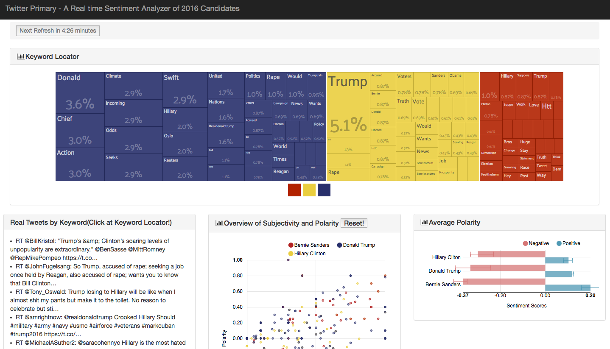

# Group-12-INET-2016-Candidates
Group 12 - INET - 2016-Candidates (Linfeng Zhou,  Yi Zhang,  Yunong Cao,  Zeyu Jiang)

##Version 1.1 (Final Version)

### Descriptions:
The project is designed to visualize what twitter users are talking about for the 2016 US presidential election and their preference towards different candidates based on real-time twitter data using the sentiment analysis method. People who are interested in politics would definitely benefit from our UI to get an intuitive idea about how to use social media to help them get campaign success. In addition, the campaign group of various candidates can also leverage our UI to make and adjust their campaign strategy to attract a certain group of voters.

Our visualization provides answers to below questions:  
      
  - Who is the most popular candidate on twitter according to the real-time data?
  - What are people’s attitudes towards each candidate in terms of sentiment?
  - Which candidate is receiving more positive/negative attitude comparing to others?
  - Which words are discussed most about different candidates on twitter?

Project page: 
[https://github.com/NYU-CS6313-SPRING2016/Group-12-INET-2016-Candidates](https://github.com/NYU-CS6313-SPRING2016/Group-12-INET-2016-Candidates)

Video:
[https://vimeo.com/167397229](https://vimeo.com/167397229)

Working demo:
[http://nyu-cs6313-spring2016.github.io/Group-12-INET-2016-Candidates/index.html](http://nyu-cs6313-spring2016.github.io/Group-12-INET-2016-Candidates/index.html)

[Final Report](https://github.com/NYU-CS6313-SPRING2016/Group-12-INET-2016-Candidates/blob/master/finalproject.pdf)

## Version 1.0(Demo)
### Notice: 
~~There are some issues to read the css style of our demo in this repository. However, the demo could be successfully disployed in our personal repo. Here is the link of our demo that works: http://linfengzhou.github.io/Twitter_Primary/~~

#### If you have problems loading the page, try zooming in!
